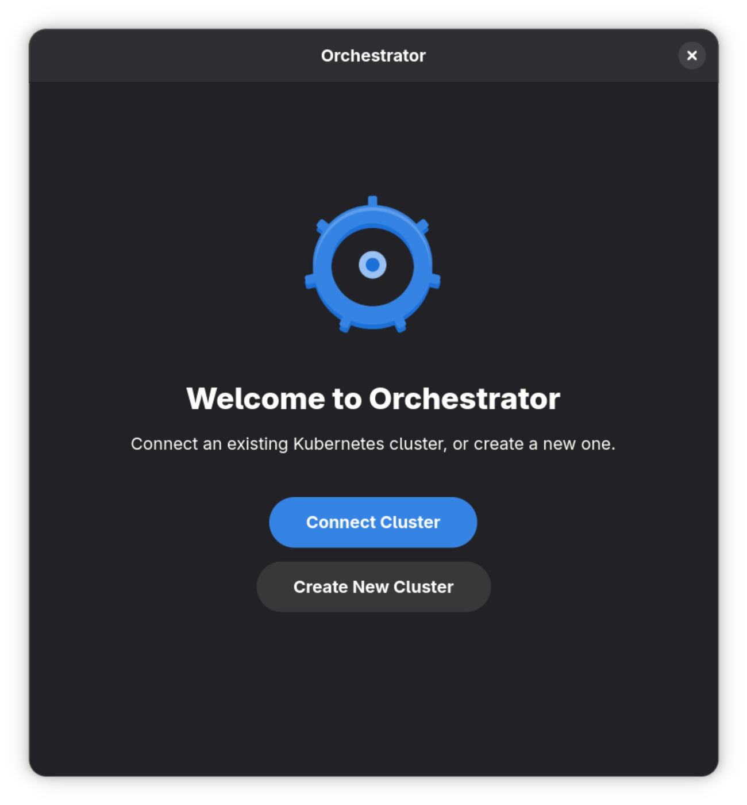
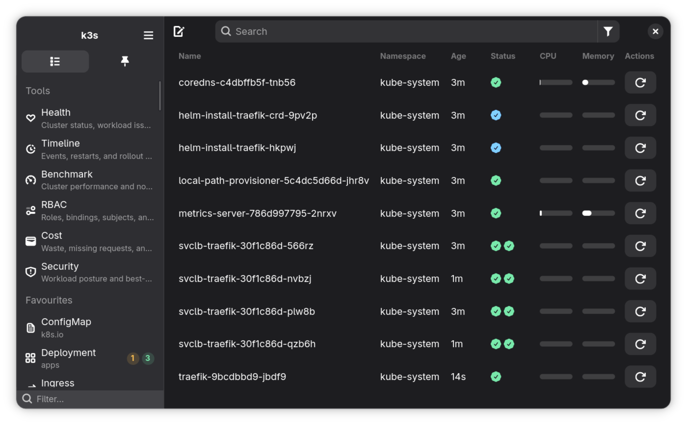
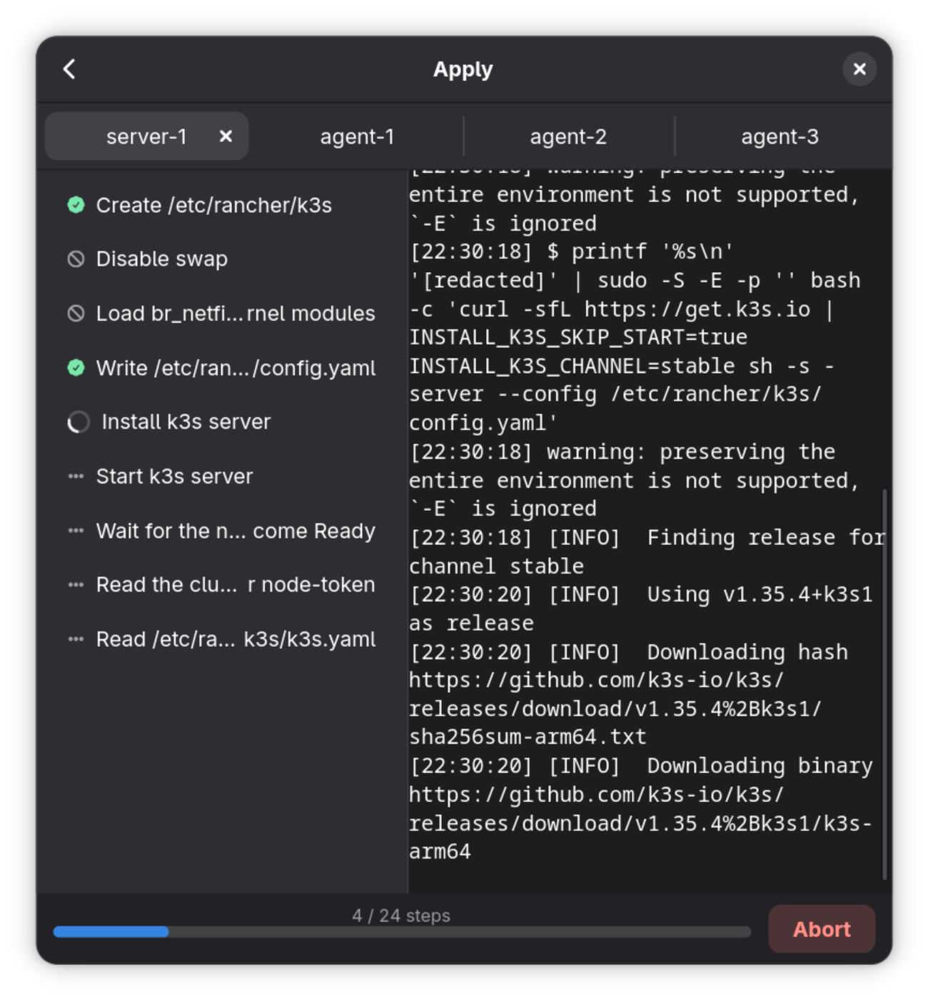

<p align="center"></p>
<h1 align="center">Orchestrator</h1>

<p align="center">A Kubernetes IDE designed for the GNOME desktop. Explore and manage your clusters with a simple and intuitive interface, equipped with a terminal, live logs, metrics, and an inline API reference.</p>

<p align="center"><a href='https://flathub.org/apps/dev.silkepilon.Orchestrator'></a></p>

---

## Features

- Auto-discovery of kubeconfig files at `~/.kube/config` and `$KUBECONFIG`
- Connect to and switch between multiple clusters
- Manual cluster configuration via host URL, bearer token, TLS certificates, or
  exec-based auth
- Bootstrap a fresh k3s cluster on remote SSH-reachable nodes through a guided
  wizard
- Browse every resource type the cluster API exposes, including CRDs
- Pin frequently-used resource types and individual objects to the sidebar
- Filter resources by namespace and search by name in real time
- Rich resource detail panels with per-resource properties and inline metrics
- Stream live container logs from any resource detail panel
- Interactive shell inside any container via a full VTE-based terminal emulator
- Forward container ports to `localhost` with a single click
- Edit any resource as YAML with syntax highlighting and an inline API reference
- Create new resources directly from the editor
- Read-only mode to prevent accidental write operations
- Update notifications and a crash window that catches unhandled errors

## Screenies

|                 Welcome                  |                Main                |           Bootstrap Probe            |                Apply                 |
| :--------------------------------------: | :--------------------------------: | :----------------------------------: | :----------------------------------: |
|  |  |  |  |

## Dependencies

The following dependencies are required to build from source.

- `golang`
- `gtk4`
- `libadwaita-1`
- `gtksourceview-5`
- `gobject-introspection`
- `glib-2.0`
- `vte-2.91-gtk4` (Linux only, required for the terminal)

## Install

### Linux (Flatpak)

Most Linux distributions come with Flatpak preinstalled, make sure your device
has [the Flathub repo enabled](https://flathub.org/en/setup).

```sh
flatpak install flathub dev.silkepilon.Orchestrator
```

### Other platforms

Downloads for all platforms are available under
[releases](https://github.com/SilkePilon/Orchestrator/releases).

## Build

### Linux / macOS

#### 1. Install dependencies

##### Fedora

```sh
sudo dnf install gtk4-devel gtksourceview5-devel libadwaita-devel gobject-introspection-devel glib2-devel vte291-gtk4-devel golang
```

##### Debian / Ubuntu

```sh
sudo apt install libgtk-4-dev libgtksourceview-5-dev libadwaita-1-dev libgirepository1.0-dev libglib2.0-dev-bin libvte-2.91-gtk4-dev golang-go
```

##### macOS (Homebrew)

```sh
brew install go gtk4 libadwaita gtksourceview5 gobject-introspection glib
```

#### 2. Build and run

```sh
go generate ./...
go build
go run .
```

### Flatpak

```sh
make flatpak-build
make flatpak-install
```

Validate the desktop and AppStream metadata before submitting updates:

```sh
make flatpak-validate
```

## Credits

Orchestrator was inspired by and built upon the foundation of
[Seabird](https://github.com/getseabird/seabird), a beautiful Kubernetes IDE for
the GNOME desktop. Seabird proved that a clean, native Linux Kubernetes client
was both possible and desirable. Orchestrator started as a personal fork because
the original project was great but lacked a way to quickly spin up a fresh
cluster — the built-in k3s bootstrap wizard fills that gap.

## License

Orchestrator is available under the terms of the Mozilla Public License v2. A
copy of the license is distributed in the LICENSE file.
